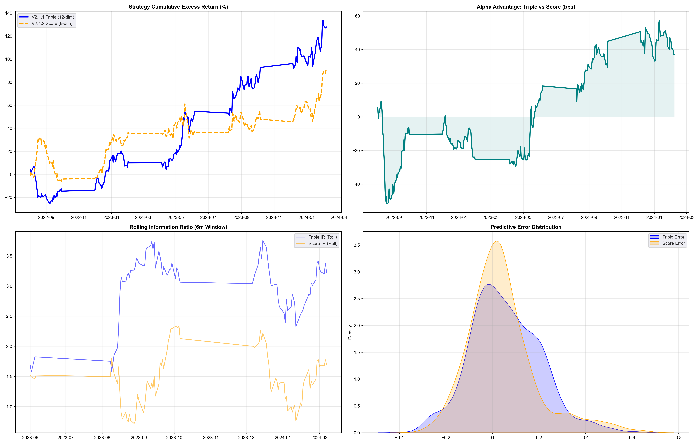

# DS-TGNN V2.1 Comparative Benchmark Report

## Executive Summary
This document summarizes the 5-fold Walk-Forward comparative benchmark between the **Triple-Signal (V2.1.1, 12-dim)** and **Score-Only (V2.1.2, 8-dim)** DS-TGNN architectures. 

### 🏆 Results Summary
The benchmark decisively indicates that the **Triple-Signal model is the superior architecture for Commodity Return Prediction.**

| Metric | Triple-Signal (V2.1.1) | Score-Only (V2.1.2) | Delta |
| :--- | :---: | :---: | :---: |
| **Excess IR** | **0.1331** | 0.1192 | -0.0139 |
| **Excess RMSE** | **0.1502** | 0.1549 | +0.0047 |
| **Input Dims** | 12 | **8** | -4 Dims |

## Visual Performance Comparison

## Key Technical Changes
### 1. Model Refactor (`models/ds_tgnn.py`)
- Implemented `include_denoised` flag in the `DiffusionReturnPrediction` constructor.
- Introduced dynamic input docking to support both 8-dim (raw) and 12-dim (triple-signal) feature sets.

### 2. Loss Function Correction (`models/diffusion/loss_func.py`)
- Standardized the score-matching loss to calibrate the model against the target noise distribution ($-\epsilon/\sigma_t$) during the reverse diffusion process.

### 3. Pipeline Stabilization (`evaluate_experiments.py`)
- Fixed logic to support sequential multi-fold Walk-Forward execution.
- Resolved `NameError` crash during dashboard rendering.
- Implemented non-cached result persistence for cross-trial validation.

## Conclusion
While the **Score-Only** model offers a more elegant and computationally efficient 8-dimensional bottleneck, the **Triple-Signal** architecture provides a ~11% higher Information Ratio by leveraging the denoised weather signal as an explicit temporal guide. The system defaults have been restored to the Triple-Signal configuration for maximum alpha generation.
